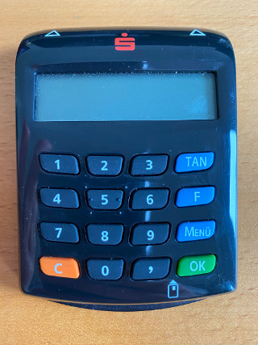

# Flicker-TAN Component 

## Technical background 

Flicker TAN or officially "HHD-Erweiterung für unidirektionale Kopplung" (no idea how to translate that properly)
is a method of transmitting authentication parameters to a handheld reader device  that creates a TAN using the EMV chip 
on the card. Instead of using a QR-Code or a static picture to encode the authentication information, FlickerTAN 
uses an animated pattern of five fields, like the ones displayed below.

  

The card reader device looks like this:

The flicker code is read by the five LED on the top of the reader device :

Each LED reads the color of one the fields. The leftmost field does not transmit any data, instead it provides a clock 
signal to synchronize the reader device  to the speed of the animation (This is explained in more detail below).

## The authentication parameters 
 
Usually the authentication parameters are send by the issuer during an authentication. They are provided in a specific format 
that will be explained in this section    

An example of the payload send by the issuer looks like this: 

`267160      0550,00$26726161550012MerchantName0550,0012Währung: EUR`

This string contains actually two messages separated by the dollar sign: 

| payload | purpose |
|---------|---------|
|`267160      0550,00`| Authentiction parameters for the manual mode|
|`26726161550012MerchantName0550,0012Währung: EUR`| Authentication parameters for the animated flicker code|

### Manual mode
 
If for some reason it is not possible to display the animated pattern, manual mode is activated as a fallback. In manual 
mode the user is instructed to manually enter authentication parameters into the reader device  and generate the TAN.
Usually this will be a single init value.

#### Structure of the manual challenge:

The structure for the manual challenge according to the official specification looks like this (`zzz`, `nn` and `p*` are placeholders that will be explained below):

`26716zzznnp*` 

Split up into the individual fields the message would look like this:

| field value | description | 
|-------------|-------------|
| 2           | Indicator what message structure is used. "2" stands for "Selektionstechnik" For our use case it can be seen as a simple constant |
| 67          | Numerical code that stands for the type of payment. 67 stands for internet payment |
| 16          | Numerical code that describes the type of the payload in the message. 16 stands for transaction amount |
| zzz         | A three digit random number |
| nn          | payload length indicator |
| p*          | the payload (in our case the transaction amount) The number of characters in the payload field is indicated by the value of the length field|
 
#### Sparda special case for the manual mode

In case of Sparda the manual field is an issuer specific special case and is structured differently. 
It always looks like this:

`267160      aaaaaa`

The header is the same for the first five bytes, but the three random digits are replaced by a single `0`. Also instead 
using the two byte length indicator described in the table above the amount value is space separated.
  
### Flicker mode 

The authentication parameters for the flicker tan look like this example:

`26726161550012MerchantName0550,0013Currency: EUR`

If we separate this message into the individual fields and replace some of the non constant values from the example
with placeholders, we get something like this:

`2 67 26 16 15 zzz nn pp nn pp nn pp` 

The individual fields described for this example:

| field value | description | 
|-------------|-------------|
| 2           | Indicator what message structure is used. "2" stands for "Selektionstechnik" For our use case it can be seen as a simple constant |
| 67          | Numerical code that stands for the type of payment. 67 stands for internet payment |
| 26          | Numerical indicator for merchant name |
| 16          | Numerical indicator for amount | 
| 15          | Numerical indicator for bank data e.g. a field that can be used by the bank for arbitrary information | 
| zzz         | 3 digit random number provided by the issuer |
| nn          | length indicator for the following payload field (here the merchant name)|
| pp          | the payload with a length as indicated by the preceding nn length indicator (here the merchant name)|
| nn          | length indicator for the following payload field (here the amount)|
| pp          | the payload with a length as indicated by the preceding nn length indicator (here the amount)|
| nn          | length indicator for the following payload field (here the bank data)|
| pp          | the payload with a length as indicated by the preceding nn length indicator (here the bank data)|

The range from (including) message structure indicator to the 3 digit random number (including) is also referred to as the 
Startcode, as you will see below.

The basic concept in the message structure is that the values between the prefix `267`and the 3 digit random number 
indicate the type and order of the following payload fields. As you can see in the example above the sequence `26 16 15`
indicates that the payload fields will be in the order Merchant name (26), Amount (16) and arbitrary bank data (15). The 
numerical values for the different types of payload fields are specificed in the official documentation, but for the 3DS 
use case only 16,15 and 26 are used.
 
If we apply this structure to the example string it looks like this:

`2 67 26 16 15 500 12 MerchantName 05 50,00 13 Currency: EUR`

#### Encoding of the text fields 

Before the authentication parameters can be transmitted to the reader device  the characters in the text must converted to a 
modified ISO 646 character set. For the most part this encoding is identical with the characters defined in the 
ISO 8859 / ASCII standard for the characters codes below $7f. But there are the following modifications to make 
some characters available not normally available in the ISO 646 character set:

| character code | character |
|----------------|-----------|
| $23            | #         |
| $24            | €         |
| $40            | @         |
| $5B            | Ä         |
| $5C            | Ö         |
| $5D            | Ü         |
| $5E            | &#x00a3;  |
| $7B            | ä         |
| $7C            | ö         |
| $7D            | ü         |
| $7E            | &#x00DF;  |

### Preparation for display as a flicker tan

In addition to the conversion of the character set some fields are added and others are modified compared to the 
original authentication message.
 
After this conversion the example message looks like this (in hex and with spaces between the individual fields):

`2A 86 01 26 72 61 61 55 00 4C 4D65726368616E744E616D65 45 35302C3030 4D 43757272656E63793A20455552 48`

| Value from example | Name | Description | 
|--------------------|------|-------------|
| `2A`               | Payload length      | Length of the payload (excluding the synchronisation pattern) |
| `86`               | Message format | describes the format of start code. One byte. See blow for details) |
| `01` | Control byte | for our use this is always set to 0x01 |
| `26 72 61 61 55 00` | Startcode | The start code we received from the issuer |
| `4C` | Format / Length indicator 1 | Describes the length and the format of the following payload field. See detailed description below.|
| `4D65726368616E744E616D65` | Payload data 1 | Payload field from the authentication message. Here encoded in ISO 676 and displayed as hex |
| `45` | Format / Length indicator 2 | Describes the length and the format of the following payload field. See detailed description below. |
| `35302C3030` | Payload data 2 | Payload field from the authentication message. Here encoded in ISO 676 and displayed as hex |
| `4D` | Format / Length indicator 3 | Describes the length and the format of the following payload field. See detailed description below. |
| `43757272656E63793A20455552` | Payload data 3 | Payload field from the authentication message. Here encoded in ISO 676 and displayed as hex |
| `48` | Checksum | Checksum for the message. See below for a detailed description | 

`Payload length | Format / Length Startcode | ControlByte | Startcode | Fmt / Length data 1 | data 1 | Fmt / Length data 2 | data 2 |  Fmt / Length data 2 | data 2 | Checksum` 

 
- Payload length : : Length: 1 Byte
-  : . Length: 1 Byte 
    - Internal structure of the Format byte
 
- Control Byte : for our purposes always set to `0x01` Length: 1 Byte
- Startcode: Startcode from the  

- Length/Format : 
- Data field : Value in ISO 676 encoding   
- Checksum :     

#### Message Format Field

The internal structure of the format field is:

   - Bit 7: set if a control byte is included. (In this use case always set to 1)
   - Bit 6: Indicator if the start code is encoded in ASCII or BCD. (In our use case it's always BCD)
   - Bits 5..0 : the length of the Startcode 
 
 #### Format / Length field
 
 The Length / Format fields contains not only the length of the following payload field but also how the payload is 
 encoded. The structure of this field is as follows:
 
  - bit 7 : always set to 0
  - bit 6 : encoding of the following data field ( 1:ISO 676 (ASCII)  / 0 : BCD)
  - bits 0-5 : length of datafield
 
 #### Checksum field
 
The checksum is one byte long. It actually consists of two checksums 
- bits 7-4 : Luhn number (Luhn number is calculated from the control byte, the startcode and the data elements)
- bits 3-0 :  xor value over all 4 bit groups of the message, starting from challenge length up and including the data fields.
 
## Final preparation

Before the message is displayed by the animated graphics, two additional modification are done:

- Adding a synchronisation pattern at the beginning of the message. The synchronisation is the 12 bit group `0x0FF`
This pattern is used by the reader to detect the beginning of the message in the image sequence. 
- In every byte in the message the the bit groups 0..3, 4..7 are switched. Example: 0x12 becomes 0x21 after the switch.

As a result the final message that will be displayed, is this (no spaces in the real message, they are only 
used to make the example more readable ):

`0FF A2 68 10 622716165500 C4 D45627368616E647E416D656 54 5303C20303 D4 3457272756E63697A302545525 84` 

## Transmission to the reader device  

The display of the code occurs in groups of 4 bits for each animation frame. The four bits are displayed 
by field 2 to field 5 (starting from the left). Field 1, the leftmost field, serves as the clock signal to
the reader device  with the flicker animation. 

The synchronisation field displays a 1->0 (white -> black) sequence at twice the frequency of the other fields continously. 
The reader starts reading the brightness on the 4 LEDs 2 to 5 if it detects a switch from white to black on LED 1 
and stops the reading of the current 4 bits if it detects a switch from black to white on LED 1.

  

 

